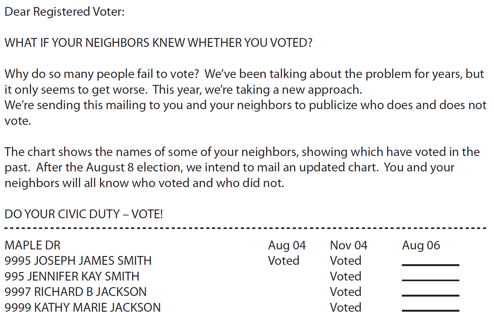

    
```{r global_options, include=T, echo = F}
knitr::opts_chunk$set(echo = T, warning=FALSE, message=FALSE)
```

# Prelude

Before running this Rmarkdown notebook, ensure that the `rmarkdown` package is installed (`install.packages("rmarkdown")`). Additionally, load the necessary libraries and data sets:

```{r}
# You may need to install these packages... Uncomment to do so
# install.packages("devtools")
# devtools::install_github("kosukeimai/qss-package")
library(qss)
data("social", package = "qss")
```

<div style="margin-top: -60px;"></div>

# Introduction

Three social scientists conducted a randomized controlled trial (RCT) to examine whether social pressure within neighborhoods increases voter participation^[Alan S. Gerber, Donald P. Green, and Christopher W. Larimer (2008) “Social pressure and voter turnout: Evidence from a large-scale field experiment.” American Political Science Review, vol. 102, no. 1, pp. 33–48.]. During a primary election in Michigan, they randomly assigned registered voters to receive different types of get-out-the-vote (GOTV) postcards and analyzed whether these messages increased voter turnout. The researchers took advantage of the fact that, in the United States, individual voter turnout records are publicly available.

The GOTV message of greatest interest used a naming-and-shaming strategy, informing voters that their neighbors would be notified about whether they participated in the election. The hypothesis was:

  * **Hypothesis:** Social pressure increases voter turnout. 
  
An example of the actual naming-and-shaming message is shown next:

<div style="text-align: center;">
  {width=70%}
</div>

<div style="margin-top: 20px;"></div>

The study also included a control group that received no mailing and additional GOTV messages with different approaches. For instance, a standard “civic duty” message began with the same introductory sentences as the naming-and-shaming message but omitted any reference to neighbors being informed. Instead, the message emphasized the importance of voting as a civic responsibility:

    The whole point of democracy is that citizens are active participants in government; that we have a voice in government. Your voice starts with your vote. On August 8, remember your rights and responsibilities as a citizen. Remember to vote. DO YOUR CIVIC DUTY – VOTE!
  
An essential aspect of this RCT was the researchers' effort to distinguish the effect of the naming-and-shaming strategy from the broader effect of being observed. In many RCTs, there is a risk that participants may change their behavior simply because they know they are being monitored, a phenomenon known as the **Hawthorne effect**.

  * **Hawthorne effect:** refers to the phenomenon where study subjects behave differently because they know they are being observed by researchers.

This term originates from a factory study where researchers found that workers’ productivity increased simply due to their awareness of being observed as part of the research.

To account for this potential bias, the study included an additional GOTV message that explicitly highlighted the participants' awareness of being studied. This message began with the phrase **“YOU ARE BEING STUDIED!”** and then included the same introductory sentences as the naming-and-shaming message. The remainder of the message read as follows:

    This year, we’re trying to figure out why people do or do not vote. We’ll be studying voter turnout in the August 8 primary election. Our analysis will be based on public records, so you will not be contacted again or disturbed in any way. Anything we learn about your voting or not voting will remain confidential and will not be disclosed to anyone else. DO YOUR CIVIC DUTY – VOTE!
    
In this experiment, therefore, there are three treatment groups: 
  
  1. Voters who receive the **social pressure message**, 
  2. voters who receive the the **civic duty message**, 
  3. voters who receive the **Hawthorne effect message**,
  
and one control group:
  
  4. voters receiving no message.
  
The researchers randomly assigned each voter to one of the four groups and examined whether the voter turnout was different across the groups

<div style="margin-top: -60px;"></div>

# The Data

The data set (accessible in the [Prelude](#Prelude) section) contains `r nrow(social)` observations and `r ncol(social)` variables. Each observation in the data set represents a village and there are two villages associated with each GP. The variables are:

  * `hhsize`: household size of the voter
  * `messages`: GOTV messages the voter received (`Civic Duty`, `Control`, `Neighbors`, `Hawthorne`)
  * `sex`: sex of the voter (`female` or `male`)
  * `yearofbirth`: year of birth of the voter
  * `primary2004`: whether the voter voted in the 2004 primary election (1=voted, 0=abstained)
  * `primary2006`: whether the voter turned out in the 2006 primary election (1=voted, 0=abstained)

Below is a summary of the basic statistics for each variable.

```{r}
summary(social)
```

<div style="margin-top: -60px;"></div>

# Difference-in-means as a causal effect estimation

The `tapply()` function can be used to calculate the voter turnout for each treatment group. By subtracting the baseline turnout of the control group from the turnout of each treatment group, we can determine the **average causal effect** of each GOTV message. Here, the outcome variable of interest is voter turnout in the 2006 primary election. This variable, `primary2006`, is coded as binary: a value of 1 indicates turnout, while 0 represents abstention.

```{r}
## turnout for each group
tapply(social$primary2006, social$messages, mean)
## turnout for control group
mean(social$primary2006[social$messages == "Control"])
## subtract control group turnout from each group
tapply(social$primary2006, social$messages, mean) - mean(social$primary2006[social$messages == "Control"])
```

The results show that:

  * compared to the control group, the naming-and-shaming GOTV message increases turnout by 8.1 percentage points on average;
  * the civic duty message has a much smaller effect, increasing turnout by only 1.8 percentage points on average; 
  * the Hawthorne boosts turnout by 2.5 percentage on average, which, interestingly, is greater than the effect of the civic duty message but remains far smaller than the substantial impact of the naming-and-shaming message.

Lastly, to ensure that the randomization of treatment assignment was successful, we should not observe significant differences across groups in pretreatment variables such as age (represented by `yearofbirth`), turnout in the previous primary election (`primary2004`), and household size (`hhsize`). These variables can be examined using similar syntax.

```{r}
social$age <- 2006 - social$yearofbirth # create age variable
tapply(social$age, social$messages, mean)
tapply(social$primary2004, social$messages, mean)
tapply(social$hhsize, social$messages, mean)
```

We observe insignificant differences in pretreatment variables across groups, validating that the randomization of treatment assignment makes the four groups essentially identical to one another on average.

<div style="margin-top: -60px;"></div>

# Using multiple linear regression for estimating the treatment effect

Fitting a multiple linear regression model is done using the function `lm()`, as in the simple case. Adding more than one predictor can by done via the `+` operator. For instance, `lm(y ~ x1 + x2 + x3)` fits the linear regression 

$$
\texttt{y} = \beta_0 + \beta_1\texttt{x1} + \beta_2\texttt{x2} + \beta_3\texttt{x3} + u
$$
<div style="margin-top: -60px;"></div>

### Categorical variables and dummmy variables

In this example, since the `messages` variable is categorical, the `lm()` function automatically transform it into a factor-class object (if the variable is not already in that format) and generates a set of indicator (or **dummy**) variables for each treatment group. Each indicator variable equals 1 if a voter is assigned to the corresponding group and 0 otherwise. These variables are used internally for computation but are not saved in the data frame.

The model includes all but the indicator variable corresponding to the **base level**. The base level of a factor variable is the first level displayed when using the `levels()` function, which lists levels in alphabetical order by default. All other levels of the factor are interpreted relative to this base level.

```{r}
# transforming into factor and checking base level, which is "Civic Duty"
levels(as.factor(social$messages))
```

<div style="margin-top: -60px;"></div>

### Fitting the regression

We now fit the linear regression model using this categorical variable.

```{r}
(fit <- lm(primary2006 ~ messages, data = social))
```

Alternatively, one can create an indicator variable for each group and then specify the regression model using them. The results are identical to those given above.

```{r}
## create indicator variables
social$Control <- ifelse(social$messages == "Control", 1, 0)
social$Hawthorne <- ifelse(social$messages == "Hawthorne", 1, 0)
social$Neighbors <- ifelse(social$messages == "Neighbors", 1, 0)
## fit the same regression as above by directly using indicator variables
lm(primary2006 ~ Control + Hawthorne + Neighbors, data = social)
```

Mathematically, the linear regression model we fitted is represented as:

$$
Y = \beta_0 + \beta_1 \texttt{Control} + \beta_2 \texttt{Hawthorne} + \beta_3 \texttt{Neighbors} + u
$$

In this model, each predictor is an indicator variable for the corresponding treatment group. Since the base level of the `messages` variable is `"Civic Duty"`, the `lm()` function excludes the indicator variable for this group. Using the fitted model, we can predict the average outcome, which in this case is the average proportion of voters who turned out.

For example, under the Control condition, the predicted average outcome is:

$$
\hat{\beta}_0 + \hat{\beta}_1 = 0.315 + (-0.018) = 0.297 \quad \text{or} \quad 29.7\%
$$

Similarly, for the Neighbors group, the predicted average outcome is:

$$
\hat{\beta}_0 + \hat{\beta}_3 = 0.315 + 0.063 = 0.378 \quad \text{or} \quad 37.8\%
$$
<div style="margin-top: -60px;"></div>

### Predicting values

To obtain the predicted average outcomes, we use the `predict()` function. This function, similar to the `fitted()` function, takes the output from the `lm()` function and computes predicted values. However, unlike the `fitted()` function (which calculates predictions for the sample used to fit the model) the `predict()` function can take a new data frame (provided as the `newdata` argument) and make predictions for each observation in this new data frame. 

The new data frame must have variables names that match the predictors of the fitted linear model, though the values can differ. In this case, we create a new data frame using the `data.frame()` function. The resulting data frame contains the same `messages` variable as the model's predictor, but only four observations, each corresponding to one of the unique values of the original `messages` variable. We use the `unique()` function to extract these unique values, returning them in the order of their first occurrence.

```{r}
## create a data frame with unique values of “messages”
(unique.messages <- data.frame(messages = unique(social$messages)))
## make prediction for each observation from this new data frame
predict(fit, newdata = unique.messages)
```

<div style="margin-top: -60px;"></div>

### Predictions and difference-in-means estimators

As in the case of a linear regression model with a single binary predictor, the predicted average outcome for each treatment condition is equal to the sample average within the corresponding subset of the data.

```{r}
## sample average
tapply(social$primary2006, social$messages, mean)
```

To make the output of linear regression more interpretable, we can omit the intercept and include all four indicator variables, rather than excluding the indicator variable for the base level to include a common intercept. 

This alternative specification allows us to directly estimate the average outcome within each group, with the coefficient of each indicator variable representing the group’s average. To remove the intercept in a linear regression model, we simply include `-1` in the formula.

```{r}
## linear regression without intercept
(fit.noint <- lm(primary2006 ~ -1 + messages, data = social))
```

Each coefficient in the model without an intercept represents the average outcome for a specific group. This allows us to estimate the average treatment effect for each condition (`Civic Duty`, `Hawthorne`, or `Neighbors`) relative to the control group by subtracting the control group’s coefficient, which serves as the baseline. 

The difference in estimated causal effects between any two groups is equal to the difference between their corresponding coefficients, regardless of whether the model includes or excludes an intercept. For example, the average effect of the `Neighbors` treatment relative to the Control condition is calculated as:

$$
0.378 - 0.297 \quad \text{(in the no-intercept model)}
$$
or equivalently:

$$
0.063 - (-0.018) \quad \text{(in the original model with an intercept)}.
$$

In both cases, the result is 0.081 or 8.1 percentage points. 

  * The same estimate of the average causal effect can be derived using two methods: linear regression with a factor treatment variable or the difference-in-means estimator. Both approaches yield consistent results.
  
```{r}
## estimated average effect of “Neighbors” condition
coef(fit)["messagesNeighbors"] - coef(fit)["messagesControl"]
## difference-in-means
mean(social$primary2006[social$messages == "Neighbors"]) - mean(social$primary2006[social$messages == "Control"])
```

<div style="margin-top: -60px;"></div>

### Assesing significance of the causal effects

Suppose now that you want to answer the following question:

  * **Question (version 1):** Does the average turnout in the `Hawthorne` group is significantly different from the `CivicDuty` group.
  
The question can be reformulated as
  
  * **Question (version 2):** Is the causal effect of the treatment `Hawthorne` compared to the control `CivicDuty` different from 0?  
  
We already estimated that the treatment effect between the `Hawthorne` and the `CivicDuty` groups is about `r round(coef(fit)["messagesHawthorne"], 2)`. But, what if the actual treatment effect is 0 and the estimation is different from zero just due to randomness in the data.

Recall that the estimated treatment effect is the difference-in-means estimator calculated in the coefficient associated to the `Hawthorne` regressor $\beta_2$. Therefore, the question can be reformulated again as

  * **Question (version 3):** Is $\beta_2$ different from 0?
  
We know that we can rely on the $p$-value associated to $\beta_2$ to answer this type of question

```{r}
fit_summary <- summary(fit) # obtaining the summary
fit_summary$coefficients # Obtaining the coefficients' inference
```

The corresponding $p$-value is about 0.0192. Thus,

  * For any confidence level lower than $(1 - 0.0192) * 100\%$, we **can** guarantee that the causal effect is significantly different from 0.
  * For any confidence level greater than $(1 - 0.0192) * 100\%$, we **cannot** guarantee that the causal effect is significantly different from 0.
  
As an important side note, **these conclusions are only valid if the model assumptions are met** (see exercises below)
  
<div style="margin-top: -60px;"></div>

### Goodness of fit

Recall that, unlike in the simple case, the coefficient of determination $R^2$ is not a reliable measure of fit when more than one regressor is added. The reason is the tendency of the $R^2$ to increase when new regressors are included regardless their significance to explain the response. 

To mitigate this inflation, the adjusted $R^2$, or $\overline{R}^2$, is created as
$$
\overline{R}^2 = 1 - \frac{SSR/(n-k-1)}{TSS/(n-1)},
$$
where $n$ is the number of obervations and $k$ is the number of regressors considered. We can obtain $\overline{R}^2$ by applying the `summary()` function to the `lm` object `fit`.

```{r}
fit_summary$adj.r.squared # extracting the adjusted R^2
```

The $\overline{R}^2$ coefficient is very low scoring about 0.0032 in this case. Therefore, even though we are very confident (see the $p$-values) about saying that there is difference in the average turnout scores between the `CivicDuty` group and the others,

  * the `message` variable alone is very poor to explain the turnout scores, explaining about 0.3\% of its variability.

<div style="margin-top: -60px;"></div>

# Heterogenous treatment effect

Suppose we want to investigate

  * The difference in the estimated average causal effect of the `Neighbors` message between those who voted in the 2004 primary election and those who did not. 
  
  We can do this by subsetting the data and then estimating the average treatment effect within each subset. Finally, we compare these two estimated average treatment effects.
  
```{r}
## average treatment effect (ATE) among those who voted in 2004 primary
social.voter <- subset(social, primary2004 == 1)
ate.voter <-
mean(social.voter$primary2006[social.voter$messages == "Neighbors"]) -
mean(social.voter$primary2006[social.voter$messages == "Control"])
ate.voter
## average effect among those who did not vote
social.nonvoter <- subset(social, primary2004 == 0)
ate.nonvoter <-
mean(social.nonvoter$primary2006[social.nonvoter$messages == "Neighbors"]) -
mean(social.nonvoter$primary2006[social.nonvoter$messages == "Control"])
ate.nonvoter
## difference
ate.voter - ate.nonvoter
```

We find that those who voted in the 2004 primary election have the estimated average effect of 9.7 percentage points, which is approximately 2.7 percentage points greater than those who did not vote in the election. This implies that the Neighbors message affects those who voted in the 2004 primary election more than those who did not.

<div style="margin-top: -60px;"></div>

# Interaction coefficients as heterogenous effect

<div style="margin-top: -60px;"></div>

### Using categorical variable as covariate

The same analysis can be carried out through the use of linear regression with an interaction effect between the treatment variable Neighbors and the covariate of interest `primary2004`. In our application, the model is given by

$$
\texttt{primary2006} = \beta_0 + \beta_1\texttt{primary2004} + \beta_2\texttt{Neighbors} + \beta_3(\texttt{primary2004} \times \texttt{Neighbors}) + u.
$$

The final predictor is the product of two indicator variables, `primary2004`×`Neighbors`, which is equal to 1 if and only if an individual voted in the 2004 primary election (`primary2004 = 1`) and received the `Neighbors`` treatment (`Neighbors = 1`).

Thus, according to the model, among the voters who turned out in the 2004 primary election (`primary2004 = 1`), the average effect of the Neighbors message equals $\beta_2 + \beta_3$, whereas the same effect for those who did not vote in the 2004 election (`primary2004 = 0`) equals $\beta_2$. Thus, 

  * The coefficient for the interaction term represents the additional average treatment effect the first group of voters receive relative to the second group.
  
In R, an interaction term can be represented by a colon `:` with the syntax `x1:x2` producing an interaction term between the two variables `x1` and `x2`. We illustrate the use of interaction terms by focusing on the Neighbors and Control groups.

```{r}
## subset Neighbors and Control groups
social.neighbor <- subset(social, (messages == "Control") | (messages == "Neighbors"))
## standard way to generate main and interaction effects
(fit.int <- lm(primary2006 ~ primary2004 + messages + primary2004:messages, data = social.neighbor))
```

Alternatively, an asterisk * generates two main effect terms as well as one interaction effect term. That is, the syntax `x1*x2` produces `x1`, `x2`, and `x1:x2`. In most applications, one should include the corresponding main effects when the model has an interaction term. The same regression model as above can be fitted using the following syntax.

```{r}
lm(primary2006 ~ primary2004 * messages, data = social.neighbor)
```

To interpret each estimated coefficient, it is useful to examine the predicted average outcomes. 

For individuals who voted in the 2004 primary election, the estimated average effect of the `Neighbors` treatment is determined by the difference in the predicted average outcomes between the treatment and control groups. That is,

  * For individuals who voted in the 2004 primary election, the estimated average effect of the `Neighbors` treatment is determined is $(\hat{\beta_0} + \hat{\beta}_1 + \hat{\beta}_2 + \hat{\beta}_3) - (\hat{\beta_0} + \hat{\beta}_1) = \hat{\beta}_2 + \hat{\beta}_3$. 

In contrast, 

  * The estimated average treatment effect for individuals who did not vote in the 2004 primary election is $(\hat{\beta_0} + \hat{\beta}_2) - \hat{\beta_0} = \hat{\beta}_2$. 
  
Thus, the difference in the estimated treatment effects between voters and non-voters from the 2004 primary is captured by the coefficient for the interaction term, $\hat{\beta}_3$. This difference can be expressed as $(\hat{\beta}_2 + \hat{\beta}_3) - \hat{\beta}_2 = \hat{\beta}_3$, indicating that 

  * $\hat{\beta}_3$ represents how the treatment effect varies as a function of the covariate.
  
Therefore,

  * **Conclusion:** The (causal, because of RCTs) effect on average turnout percentages of the naming-and-blaming GOTV message (`Neightbors` variable as treatment) is increase by 2.7 units in the voters who voted in the 2004 primary election compared to those who did not.
  
```{r}
summary(fit.int)
```

Moreover, as the summary of the linear model shows, the $p$-value associated to $\beta_3$ is lower than the smaller number the machine can represent, $2\times 10^{-16}$, meaning that

  * The estimated causal effect is significantly different from zero for a confidence level greater than 99%.

<div style="margin-top: -60px;"></div>

### Using continuous variable as covariate

So far, the focus has been on categorical or factor variables, but continuous variables can also serve as predictors. 

Using continuous variables, however, relies on the assumption of linearity—meaning that a one-unit increase in the predictor results in a fixed change in the outcome, irrespective of the baseline value. For instance, in this context, the voter’s age in 2006 is used as a continuous predictor, calculated by subtracting the year of birth from the election year.

```{r}
social.neighbor$age <- 2006 - social.neighbor$yearofbirth
summary(social.neighbor$age)
```

In this subset of data, voter ages range from 22 to 106. We now investigate how the average causal effect of the Neighbors treatment varies with age. To achieve this, we fit the linear model

$$
Y = \beta_0 + \beta_1 \cdot \texttt{age} + \beta_2 \cdot \texttt{Neighbors} + \beta_3 \cdot (\texttt{age} \times \texttt{Neighbors}) + u
$$

Using the same computation strategy as before, we calculate how the average treatment effect changes as a function of age. For a group of voters aged $x$, the estimated average treatment effect of the Neighbors message is:

$$
(\hat{\beta}_0 + \hat{\beta}_1x + \hat{\beta}_2 + \hat{\beta}_3x) - (\hat{\beta}_0 + \hat{\beta}_1x) = \hat{\beta}_2 + \hat{\beta}_3x
$$


For voters aged $x + 1$, the estimated average effect becomes:

$$
(\hat{\beta_0} + \hat{\beta}_1(x+1) + \hat{\beta}_2 + \hat{\beta}_3(x+1)) - (\hat{\beta_0} + \hat{\beta}_1(x+1)) = \hat{\beta}_2 + \hat{\beta}_3(x+1)
$$

Thus, the estimated coefficient for the interaction term, $\hat{\beta}_3$, represents the difference in the average treatment effect between two groups of voters whose ages differ by one year:

$$
\hat{\beta}_3 = (\hat{\beta}_2 + \hat{\beta}_3(x+1)) - (\hat{\beta}_2 + \hat{\beta}_3x)
$$

To compute this difference in R, we first fit a linear regression model that includes the interaction between the age and Neighbors variables. This can be done using the syntax ``age * Neighbors``, which generates both the main effects and the interaction term.

```{r}
(fit.age <- lm(primary2006 ~ age * messages, data = social.neighbor))
```

The results indicate that the estimated difference in the average treatment effect between two groups of voters whose ages differ by one year is 0.06 percentage points. Using this regression model, we can also calculate the estimated average treatment effect for voters of specific ages. 

For illustration, we select ages 25, 45, 65, and 85. This is done using the `predict()` function, specifying the `newdata` argument with a data frame containing these ages as separate observations. 

```{r}
## age = 25, 45, 65, 85 in Neighbors group
age.neighbor <- data.frame(age = seq(from = 25, to = 85, by = 20), messages = "Neighbors")
## age = 25, 45, 65, 85 in Control group
age.control <- data.frame(age = seq(from = 25, to = 85, by = 20), messages = "Control")
## average treatment effect for age = 25, 45, 65, 85
(ate.age <- predict(fit.age, newdata = age.neighbor) - predict(fit.age, newdata = age.control))
```

<div style="margin-top: -60px;"></div>

### Non-linearity in the regressors

Research has shown that the linearity assumption is unsuitable for modeling voter turnout. While the likelihood of voting increases with age, it begins to decline in individuals' 60s or 70s. To address this non-linearity, a common approach is to model turnout as a quadratic function of age by including the square of age as an additional predictor. The model also incorporates interaction terms, as shown below:

$$
Y = \beta_0 + \beta_1 \cdot \texttt{age} + \beta_2 \cdot \texttt{age}^2 + \beta_3 \cdot \texttt{Neighbors} + \beta_4 \cdot (\texttt{age} \times \texttt{Neighbors}) + \beta_5 \cdot (\texttt{age}^2 \times \texttt{Neighbors}) + u
$$

In R, mathematical transformations such as squaring or applying a natural logarithm can be included in a formula using the `I()` function. For example, the square of a variable `x` can be specified as `I(x^2)`. Other operations, such as the square root (`I(sqrt(x))`) or natural logarithm (`I(log(x))`), can also be applied similarly within the formula. 

```{r}
fit.age2 <- lm(primary2006 ~ age + I(age^2) + messages + age:messages + I(age^2):messages, 
               data = social.neighbor)
fit.age2
```

In a complex model like this, the coefficients are difficult to interpret directly. Instead, it is more effective to predict average outcomes under different scenarios using the `predict()` function and compute relevant quantities of interest. For this example, we predict the average turnout rate for voters aged 25 to 85 under both the Neighbors and Control conditions. The average treatment effect is then calculated as the difference between the two conditions and analyzed as a function of age. The following syntax performs this task.

```{r}
## predicted turnout rate under the Neighbors treatment condition
yT.hat <- predict(fit.age2, newdata = data.frame(age = 25:85, messages = "Neighbors"))
## predicted turnout rate under the Control condition
yC.hat <- predict(fit.age2, newdata = data.frame(age = 25:85, messages = "Control"))
```

To simplify interpretation, we visualize the results. The first plot shows predicted turnout as a function of age for the Neighbors and Control groups separately. The second plot illustrates the estimated average treatment effect as a function of age.

```{r}
## plotting the predicted turnout rate under each condition
plot(x = 25:85, y = yT.hat, type = "l", xlim = c(20, 90), ylim = c(0, 0.5), 
     xlab = "Age", ylab = "Predicted turnout rate")
lines(x = 25:85, y = yC.hat, lty = "dashed")
text(40, 0.45, "Neighbors condition")
text(45, 0.15, "Control condition")
## plotting the average treatment effect as a function of age
plot(x = 25:85, y = yT.hat - yC.hat, type = "l", xlim = c(20, 90), 
     ylim = c(0, 0.1), xlab = "Age", ylab = "Estimated average treatment effect")
```

Hence, according to this model, 

  * The estimated average treatment effect peaks around 60 years old, and the effect size is much smaller among young and old voters.

<div style="margin-top: -60px;"></div>

# Exercises

  * **Exercise 1 (Exploring Variables):**
  
  1. What are the types of variables in the dataset (categorical, numeric, etc.)? Use functions like `str()` and `summary()`.
  2. What is the distribution of the `messages` variable? Create a table or plot to visualize the proportions of each treatment group. Use the function `table()`
  3. How many voters turned out in the 2006 primary election (`primary2006`)? What percentage is this? Use the function `mean()`

  * **Exercise 2 (Exploring Relationships Between Variables):** 
  
  1. **Voter Turnout and Household Size**:
   
   - Investigate the relationship between household size (`hhsize`) and voter turnout (`primary2006`).
   - Divide the data into voters (`primary2006 == 1`) and non-voters (`primary2006 == 0`). Compare the average household size for these two groups. 
   - Visualize the distribution of household sizes for voters and non-voters using boxplots.

  2. **Gender and Turnout**:
   - Does gender (`sex`) have any relationship with voter turnout in the dataset? Create a contingency table of `sex` and `primary2006` and calculate the turnout rate for each gender.

  * **Exercise 3:** For the fitted linear model `fit`, 
  
    1. Investigate whether the model's assumptions are met.
    2. Analyse the Q-Q plot. Why does it have such form? What does that say about using discrete dependent variables?
    
  * **Exercise 4** Fit a linear model with the categorical variable `message`, using an intercept and the `Control` group as the control/baseline group. Interpret the coefficients.
    
  * **Exercise 5:** Investigate if the effect of the group that received the naming-and-shaming GOTV message is gender-heterogeneous. If so, estimate the difference in the effect between the two groups.
  
  * **Exercise 6**: Fit a linear model with the variable `age` as the output and `messages` as the input.
  
  1. Check the estimations of the parameters and their $p$-values. What can you conclude? Relate to RCTs.
  2. Comment on the model's assumptions.
  
# Acknowledgement and Copyright

These notes are adapted from the book [Quantitative Social Science](https://press.princeton.edu/books/quantitative-social-science) by Kosuke Imai.
