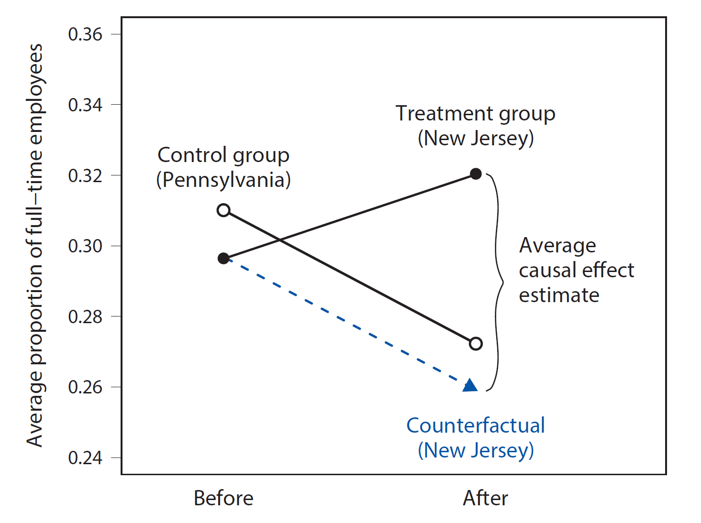

    
```{r global_options, include=T, echo = F}
knitr::opts_chunk$set(echo = T, warning=FALSE, message=FALSE)
```

# Prelude

Before running this Rmarkdown notebook, ensure that the `rmarkdown` package is installed (`install.packages("rmarkdown")`). Additionally, load the necessary libraries and data sets:

```{r}
# You may need to install these packages... Uncomment to do so
# install.packages("devtools")
# devtools::install_github("kosukeimai/qss-package")
library(qss)
data("minwage", package = "qss")
```

# Introduction

In 1992, New Jersey (NJ) raised its minimum wage from \$4.25 to \$5.05 per hour. A study conducted by two social science researchers used this opportunity to gauge the effect of raising the minimum wage on employment in the fast-food sector^[David Card and Alan Krueger (1994) “Minimum wages and employment: A case study of the fast-food industry in New Jersey and Pennsylvania.” American Economic Review, vol. 84, no. 4, pp. 772–793.]. The goal was to answer the following

  * **Research Question:** Did this wage increase lead to a reduction in employment, as predicted by traditional economic theory?
  
To answer this, we need to estimate the employment levels in NJ had the wage increase not occurred. Since we cannot directly observe this scenario, we must use available data to make an informed estimate.

<div style="margin-top: -60px;"></div>

# The Data

The data set (accessible in the [Prelude](#Prelude) section) contains `r nrow(minwage)` observations and `r ncol(minwage)` variables. The variables include:

  * `chain`: the fast-food restaurant chain name
  * `location`: restaurant location (`centralNJ`, `northNJ`, `PA`, `shoreNJ`, `southNJ`)
  * `wageBefore`: wage rate before the increase
  * `wageAfter`: wage rate after the increase
  * `fullBefore`: number of full-time employees before the wage change
  * `fullAfter`: number of full-time employees after the wage change
  * `partBefore`: number of part-time employees before the wage change
  * `partAfter`: number of part-time employees after the wage change

This dataset is an example of *observational data*, where a *treatment variable* (the wage increase) is observed to study its *causal effects* on an *outcome variable* (employment), but the researchers have no control over how the treatment is administered. In this case:

  * **Treatment variable:** the minimum wage increases from \$4.25 to \$5.05 per hour.
  * **Outcome variable:** the minimum wage remains the same.

Below is a summary of the basic statistics for each variable.

```{r}
summary(minwage)
```

<div style="margin-top: -60px;"></div>

# Estimating the Counterfactual

A common approach to estimate the counterfactual (employment without the wage increase in NJ) is to compare it with data from a state where the wage did not change. In this case, the neighboring state of Pennsylvania (PA) serves as a natural comparison.

  * **Assumption (DiM):** The economic conditions in NJ are similar to those in PA (making their fast-food industries comparable).
  
Thus, in this *cross-sectional* comparison design:

  * **Treatment group:** fast-food restaurants in NJ
  * **Control group:** fast-food restaurants in PA

<div style="margin-top: -60px;"></div>

# Data Analysis

To verify that the minimum wage was indeed raised in NJ, we first examine whether the change was implemented correctly. 

To do so, we calculate the proportion of restaurants in each state paying less than the new NJ minimum wage of \$5.05 per hour, both before and after the law was enacted.

```{r}
## subsetting the data into two states
minwageNJ <- subset(minwage, subset = (location != "PA"))
minwagePA <- subset(minwage, subset = (location == "PA"))
## proportion of restaurants whose wage is less than $5.05
mean(minwageNJ$wageBefore < 5.05) # NJ before
mean(minwageNJ$wageAfter < 5.05) # NJ after
mean(minwagePA$wageBefore < 5.05) # PA before
mean(minwagePA$wageAfter < 5.05) # PA after
```

We observe that over 91% of NJ restaurants were paying below \$5.05 before the minimum wage increased by law, after which the proportion dropped to less than 1%. In contrast, the proportion in PA remained nearly the same, suggesting the NJ law had a significant impact on wages there, while it had no effect on PA.

<div style="margin-top: -60px;"></div>

# Estimating the Causal Effect

Next, we use the PA restaurants as a control group and estimate the average causal effect of the minimum wage increase on employment in NJ restaurants.

One possible hypothesis is that firms respond to a higher minimum wage by reducing hours or shifting from full-time to part-time employment. To explore this, we examine the proportion of full-time employees.

To test this, we examine the proportion of full-time employees as the outcome variable, comparing the average values between NJ and PA restaurants after the law took effect.

Let’s calculate the **difference-in-means estimator**.

```{r}
## create a variable for proportion of full-time employees in NJ and PA
minwageNJ$fullPropAfter <- minwageNJ$fullAfter /
(minwageNJ$fullAfter + minwageNJ$partAfter)
minwagePA$fullPropAfter <- minwagePA$fullAfter /
(minwagePA$fullAfter + minwagePA$partAfter)
## compute the difference-in-means
mean(minwageNJ$fullPropAfter) - mean(minwagePA$fullPropAfter)
```

This result suggests that **the minimum wage increase did not negatively affect full-time employment**. In fact, it may have slightly increased the proportion of full-time employment in NJ fast-food restaurants.

<div style="margin-top: -60px;"></div>

# Confounding Bias

An important assumption in observational studies is that the treatment and control groups must be similar in every respect related to the outcome, except for the treatment itself.

In this study, any differences between NJ and PA fast-food industries prior to the wage increase could introduce *confounding bias*, making it difficult to attribute differences in employment solely to the minimum wage increase.

For example, if NJ had a competing industry for low-skilled workers that PA lacked, the comparison between the two states might not be valid.

<div style="margin-top: -60px;"></div>

# Controlling for Confounding Bias

While confounding bias can never be fully eliminated in observational studies, statistical methods can help control for it. One such method is **subclassification**, which involves comparing treatment and control groups within subsets of data defined by shared characteristics.

For instance, PA has a higher proportion of Burger King restaurants than NJ. This could be a confounding factor if Burger King has different employment policies. We can adjust for this by comparing only Burger King restaurants across both states.

Let’s first examine the proportion of each fast-food chain in the two samples using the `prop.table()` function.

```{r}
## proportion of fast-food chain in NJ
prop.table(table(minwageNJ$chain))
## proportion of fast-food chain in PA
prop.table(table(minwagePA$chain))
```

The results show that **PA has a larger proportion of Burger King restaurants** compared to NJ. To eliminate the potential confound from the type of fast-food chain, we compare the full-time employment rates between NJ and PA Burger King restaurants.

```{r}
## subset Burger King only
minwageNJ.bk <- subset(minwageNJ, subset = (chain == "burgerking"))
minwagePA.bk <- subset(minwagePA, subset = (chain == "burgerking"))
## comparison of full-time employment rates
mean(minwageNJ.bk$fullPropAfter) - mean(minwagePA.bk$fullPropAfter)
```

This result is similar to the overall analysis, indicating that **the type of fast-food chain may not be a confounding factor**.

We can also control for restaurant location. For example, NJ restaurants located near PA may be more comparable to PA restaurants. We can focus on the Burger King locations in northern and southern NJ, which are closest to PA, to control for location-based confounding.

```{r}
minwageNJ.bk.subset <-
subset(minwageNJ.bk, subset = ((location != "shoreNJ") &
(location != "centralNJ")))
mean(minwageNJ.bk.subset$fullPropAfter) - mean(minwagePA.bk$fullPropAfter)
```

The results remain consistent with the earlier findings, further confirming that the minimum wage increase had little effect on full-time employment.

<div style="margin-top: -60px;"></div>

# Before-and-after design

In observational studies, data gathered over a period of time provides valuable insights. When multiple measurements are taken on the same units over time, the data is referred to as **longitudinal or panel data**. In contrast, **cross-sectional data** is collected by observing many subjects at the same period of time. 

**Longitudinal data tends to offer a more reliable comparison between treatment and control groups than cross-sectional data** because it includes information on changes over time. 

In this study, the researchers collected employment and wage data from the same group of restaurants before the minimum wage increase in NJ. This pretreatment data enables various approaches for estimating causal effects in observational studies.

One approach is the comparison of measurements taken before and after the treatment, known as the **Before-and-After (BA) design**. Rather than comparing fast-food restaurants in NJ with those in PA after the minimum wage increase, this design focuses on comparing the same group of NJ fast-food restaurants before and after the wage increase. The estimate in this design is calculated as follows.

```{r}
## full-time employment proportion in the previous period for NJ
minwageNJ$fullPropBefore <- minwageNJ$fullBefore /
(minwageNJ$fullBefore + minwageNJ$partBefore)
## mean difference between before and after the minimum wage increase
NJdiff <- mean(minwageNJ$fullPropAfter) - mean(minwageNJ$fullPropBefore)
NJdiff
```

The before-and-after analysis provides an estimate that aligns with previous results. One key advantage of this approach is that it controls for confounding factors specific to each state, as the comparison is made within NJ. However, a major limitation of the before-and-after design is that it can be biased by time-varying confounders. For instance, if there is a general upward trend in the local economy, with improving wages and employment, we might mistakenly attribute these changes to the minimum wage increase. This would occur if the time trend is not directly related to the wage increase. The validity of the before-and-after design depends on the following assumption,

  * **Assumption (BA):** there are no time-varying confounders.

<div style="margin-top: -60px;"></div>

# Difference-in-differences design

The difference-in-differences (DiD) design builds upon the BA approach to correct for confounding bias caused by time trends. The main assumption behind the DiD design is:

  * **Assumption (DiD):** in the absence of treatment, the outcome variable would follow parallel trends in both the treatment and control groups. 
  
  For this particular study, this assumption is visually represented in Figure 1.

<div style="text-align: center;">
  {width=50%}
</div>

<div style="margin-top: 20px;"></div>


  The figure compares the average proportion of full-time employees before and after the wage increase for both the treatment group (fast-food restaurants in NJ, shown by solid black circles) and the control group (restaurants in PA, shown by open black circles). Using this setup, the counterfactual outcome for the treatment group is estimated by assuming that the time trend for the NJ group would mirror that of the PA group if the wage increase had not occurred. This counterfactual is indicated by the solid blue triangle in the figure. The blue dashed line represents the parallel trend assumption and is used to derive this counterfactual outcome, which aligns with the trend observed in PA (the black solid line).

**In the DiD design, the sample average causal effect for the NJ restaurants is the difference between the actual outcome after the wage increase and the counterfactual outcome, which is based on the assumption of parallel time trends.** This estimate is referred to as the **sample average treatment effect for the treated (SATT)**. Unlike the sample average treatment effect (SATE), which applies to the entire population, SATT specifically refers to the treatment group—in this case, the NJ restaurants.

To calculate this estimate we follow this steps:

  1. Compute the difference in outcomes for PA restaurants before and after the minimum wage increase in NJ. 
  2. Subtract this difference from the before-and-after difference in NJ restaurants. 

The resulting difference, computed in step 2, between the before-and-after differences of the treatment and control groups gives the DiD estimate of the average causal effect.

The DiD design thus uses both pre- and post-treatment data from the treatment and control groups. This is a broader approach compared to the cross-sectional design, which only uses post-treatment data, or the before-and-after design, which only uses data from the treatment group.

In the case of the minimum-wage study, we can compute the DiD estimate as
follows.

```{r}
## full-time employment proportion in the previous period for PA
minwagePA$fullPropBefore <- minwagePA$fullBefore /
(minwagePA$fullBefore + minwagePA$partBefore)
## mean difference between before and after for PA
PAdiff <- mean(minwagePA$fullPropAfter) - mean(minwagePA$fullPropBefore)
## difference-in-differences
NJdiff - PAdiff
```

The result contradicts the prediction of some economists, who suggest that raising the minimum wage negatively affects employment. In contrast, **our DiD analysis indicates that the wage increase may have actually led to a slight increase in the proportion of full-time employees in NJ fast-food restaurants.** The DiD estimate is higher than the before-and-after estimate, which was reflected a negative trend in PA.

# Exercises

  * **Exercise 1:** Estimate the causal effect via the DiM estimator of the cross-sectional while using the subclassification method to control for 
  
    a) KFC restaurants (`chain == "kfc"`).
    b) KFC restaurants (`chain == "kfc"`) near-PA locations (`location != shoreNJ`).
    
  Comment on the results.
  
  * **Exercise 2:** Estimate the causal effect using the before-and-after method and controlling for Burger King and KFC restaurants.
  
  * **Exercise 3:** Repeat exercise 2 but using the Difference-in-differences design instead of the before-and-after one.
  
  
# Acknowledgement and Copyright

These notes are adapted from the book [Quantitative Social Science](https://press.princeton.edu/books/quantitative-social-science) by Kosuke Imai.
